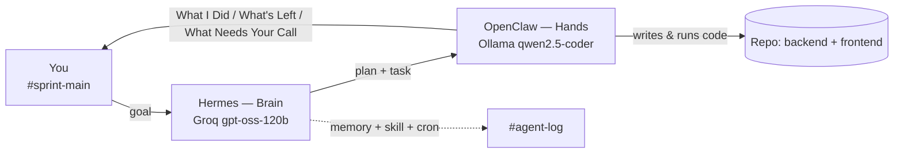

# Architecture

## Two-agent system

- **Hermes (brain):** receives the goal, decomposes it into steps, posts the plan *before* acting, hands coding tasks to OpenClaw, keeps cross-session memory, runs the `status-report` skill, and fires a scheduled update with no human prompt.
- **OpenClaw (hands):** takes a task, writes and runs the code in the repo, and reports back in the standard three-section format.
- **You:** post goals, review, approve or correct — all in Slack, nothing off-channel.

## Slack channel scheme

| Channel | Purpose |
|---------|---------|
| `#sprint-main` | You talk to Hermes. Plans, decisions, status updates land here. |
| `#agent-coder` | Hermes assigns coding tasks; OpenClaw works and reports here. |
| `#agent-log` | Raw agent activity + autonomous-run output. Audit trail. |

## Model routing & rationale

| Agent | Model | Endpoint |
|-------|-------|----------|
| Hermes (planning) | Groq `openai/gpt-oss-120b` | `https://api.groq.com/openai/v1` |
| OpenClaw (coding) | Ollama `qwen2.5-coder:7b` | `http://localhost:11434/v1` |

**Why this split:**

- **Planning is bursty and high-value** — it benefits from a strong model. Groq's `gpt-oss-120b` is fast and free, ideal for short reasoning/decomposition calls.
- **Coding is token-heavy and continuous.** Running `qwen2.5-coder` locally on Ollama means OpenClaw never trips Groq's low free-tier rate limit (TPM), and the model is coding-specialised, so it writes better Laravel/React.
- **Reproducible:** Ollama serves a GGUF model that runs on any machine — the setup isn't tied to specific hardware.

**Fallback ladder (on 429):** Groq `gpt-oss-120b` → Gemini `gemini-2.5-flash` → OpenRouter `:free` → Ollama (local, unlimited).

## Memory, skill, autonomous run

- **Memory:** Hermes stores project facts (repo name, default branch, model routing) and recalls them in a later session without re-pasting.
- **Skill:** [`skills/status-report/SKILL.md`](skills/status-report/SKILL.md) makes every status update return in the same three sections.
- **Autonomous run:** a Hermes cron posts a one-line progress update to `#agent-log` on a schedule with no human prompt.
