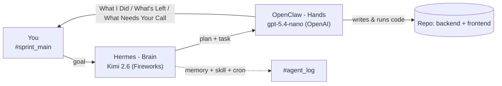

# Architecture

## Two-agent system

- **Hermes (brain):** receives the goal, decomposes it into steps, posts the plan *before* acting, hands coding tasks to OpenClaw, keeps cross-session memory, runs the `status-report` skill, and fires a scheduled update with no human prompt.
- **OpenClaw (hands):** takes a task, writes and runs the code in the repo, and reports back in the standard three-section format.
- **You:** post goals, review, approve or correct - all in Slack, nothing off-channel.

## Slack channel scheme

| Channel | Purpose |
|---------|---------|
| `#sprint_main` | You talk to Hermes. Plans, decisions, status updates land here. |
| `#agent_coder` | Coding tasks for OpenClaw; it works and reports here. |
| `#agent_log` | Raw agent activity + autonomous-run output. Audit trail. |

## Model routing & rationale

| Agent | Model | Endpoint |
|-------|-------|----------|
| Hermes (planning) | Kimi 2.6 - `accounts/fireworks/models/kimi-k2p6` | `https://api.fireworks.ai/inference/v1` |
| OpenClaw (coding) | OpenAI `gpt-5.4-nano` | `https://api.openai.com/v1` |

**Why this split:**

- **Planning is high-value and bursty** - it benefits from a strong reasoning model. Kimi 2.6 decomposes the goal and sequences the work.
- **Execution is token-heavy and repetitive** - a cheap, fast model is the right tool. `gpt-5.4-nano` does the actual file edits and command runs as OpenClaw's engine.
- This matches the brief's recommended routing: **stronger model plans, cheaper model executes.**

**On the free stack:** the setup was first wired fully free (Groq `gpt-oss-120b` for the brain, a local LFM/Ollama model for the hands). Both ran, but the end-to-end agent loop was unreliable on the free tiers. We moved to a small paid pair (gpt-5.4-nano + Kimi 2.6) to get a dependable loop - a deliberate trade of the free-stack bonus for a working build, per the brief's "a clean working setup beats an ambitious broken one."

**Fallback ladder (on rate-limit / failure):** the local model (LM Studio `lfm2.5`) and Groq remain configured as fallbacks.

## Memory, skill, autonomous run

- **Memory:** Hermes stores project facts (repo name, default branch, model routing) and recalls them in a later session without re-pasting.
- **Skill:** [`skills/status-report/SKILL.md`](skills/status-report/SKILL.md) makes every status update return in the same three sections.
- **Autonomous run:** a Hermes cron posts a one-line progress update to `#agent_log` on a schedule with no human prompt.

## Config files (in this repo, secrets removed)

- `openclaw.json` - OpenClaw config; gateway token redacted, Slack + OpenAI keys are env references.
- `hermes-config.yaml` - Hermes model routing; the Fireworks `api_key` is removed.
- `slack.socket.patch.json5`, `model.patch.json5`, `openai.patch.json5` - the exact patches applied to OpenClaw.
- `.env.example` - every env var the setup needs (fill with your own keys; never commit the real `.env`).
