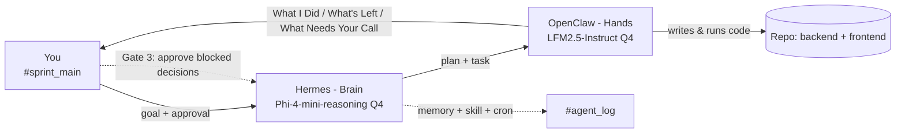

# Architecture

## Two-agent system



- **Hermes (brain):** decomposes goals, posts plans *before* acting, hands coding tasks to OpenClaw, stores cross-session memory, runs `status-report` skill, fires cron with no human prompt.
- **OpenClaw (hands):** takes approved tasks, writes/runs code, reports in three-section format.
- **You:** post goals, say yes/no to plans, review code output, answer **What Needs Your Call** — all in Slack.

## Slack channel scheme

| Channel | Purpose |
|---------|---------|
| `#sprint_main` | Human ↔ Hermes. Goals, plan approval, status updates. |
| `#agent_coder` | Coding tasks for OpenClaw; code + stdout posted here. |
| `#agent_log` | Cron heartbeat + audit trail. |

## Model routing (open-source stack)

| Agent | Model | HF source | Endpoint |
|-------|-------|-----------|----------|
| Hermes (planning) | `phi-4-mini-reasoning` | [Phi-4-mini-reasoning-GGUF](https://huggingface.co/unsloth/Phi-4-mini-reasoning-GGUF) @ Q4_K_M (MIT) | LM Studio `:1234/v1` |
| OpenClaw (coding) | `liquid/lfm2.5-1.2b-instruct` | [Instruct-GGUF](https://huggingface.co/LiquidAI/LFM2.5-1.2B-Instruct-GGUF) @ Q4_K_M | LM Studio `:1235/v1` |

**Why this split:**

- **Planning is reasoning-heavy** — Phi-4-mini-reasoning (3.8B, MIT) is the strongest small open reasoning model we evaluated; Sakana Fugu was rejected as closed-source.
- **Execution is tool-heavy** — LFM2.5-Instruct (1.2B) is fast and VRAM-light for file edits and command runs.
- **Both are open weights** — HuggingFace GGUF, local inference, 4-bit only (VRAM constraint).
- **Dual ports** — brain and hands run at the same time without swapping models.

Full rationale and rejected alternatives: [`MODEL_STACK.md`](MODEL_STACK.md).

**Optional cloud fallback:** Groq free tier via `groq-fallback.patch.json5` — not part of the open-source stack.

## Live deployment

```
Vercel (React)  →  ngrok HTTPS  →  localhost:8000 (Laravel + SQLite)
```

See [`DEPLOYMENT.md`](DEPLOYMENT.md). Frontend must not fall back to browser demo mode during judging.

## Memory, skill, autonomous run

| Feature | Config | Evidence |
|---------|--------|----------|
| **Kanban build loop** | Slack `#sprint_main` → `#agent_coder` | `agent-log.md` § Kanban build sprint, `BUILD_CHRONOLOGY.md` |
| **Memory** | `hermes-config.yaml` → `memory.enabled: true` | `agent-log.md` § Memory recall (Session A → B) |
| **Skill** | `skills/status-report/SKILL.md` | `agent-log.md` § Skill firing |
| **Cron** | `hermes-config.yaml` → `cron.forge2-heartbeat` | `agent-log.md` § Autonomous run |
| **Human-in-the-loop** | Plan approval + **What Needs Your Call** gate | `agent-log.md` § Human approval gates |

## Config files (secrets removed)

- `openclaw.json` — OpenClaw; primary `lmstudio/liquid/lfm2.5-1.2b-instruct` @ `:1235`
- `hermes-config.yaml` — Hermes; `phi-4-mini-reasoning` @ `:1234` + memory + cron
- `MODEL_STACK.md` — open-source model selection and migration notes
- `model.patch.json5`, `slack.socket.patch.json5`, `groq-fallback.patch.json5`
- `.env.example` — Slack + LM Studio vars (no paid keys)
