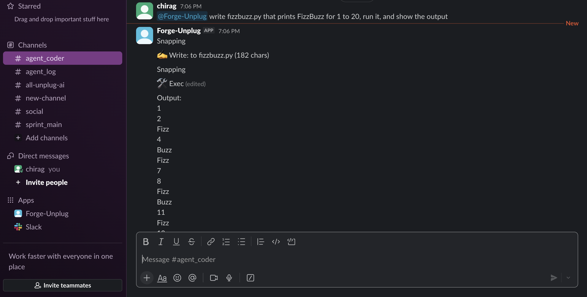
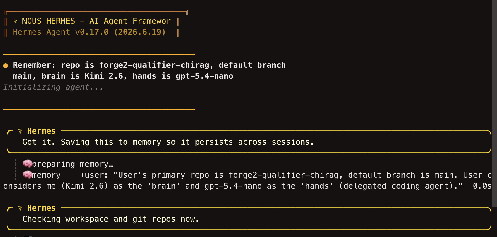
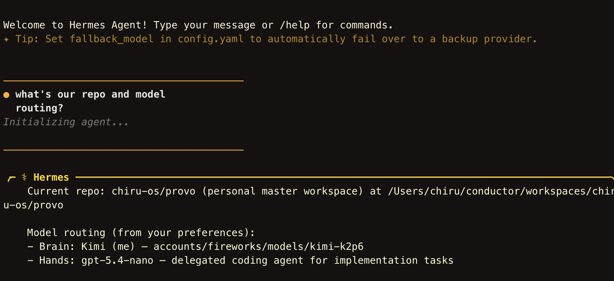
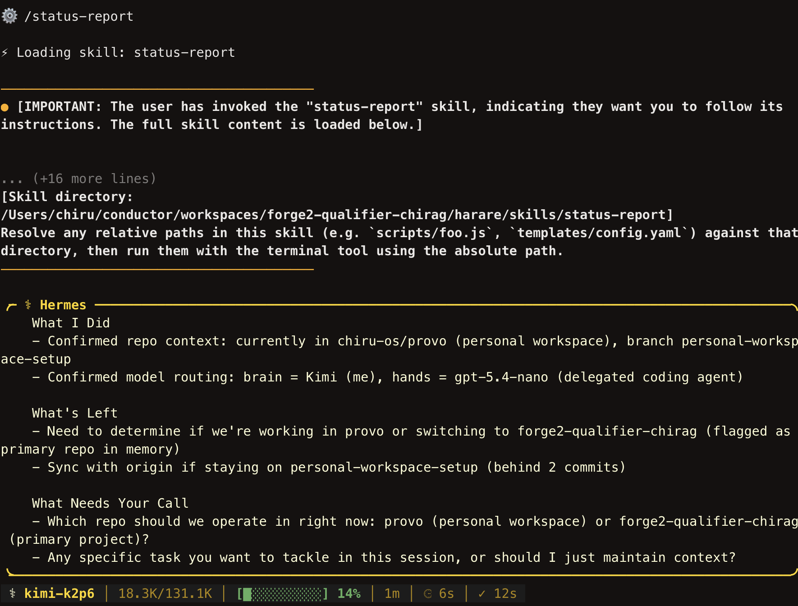
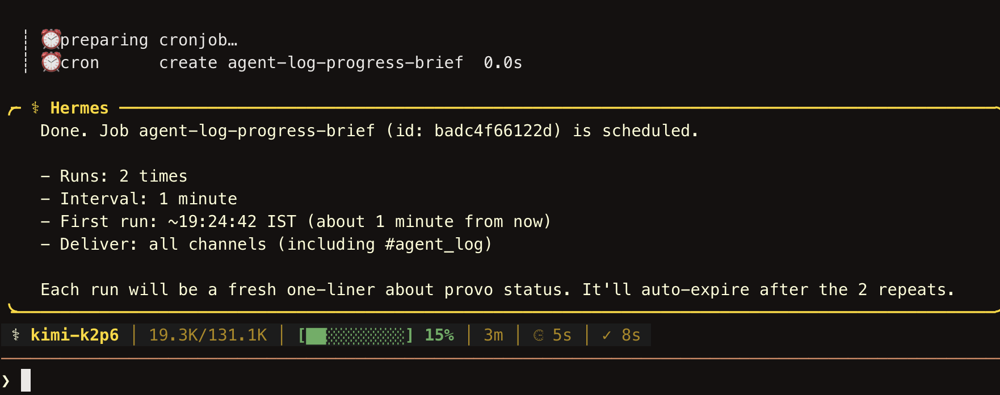

# Agent log

Record of the two-agent system being set up and driven through Slack.

## Summary (honest)

- **Both agents are stood up, configured on free-format model endpoints, and verified live:**
  - **OpenClaw (hands)** - gateway running, connected to Slack via Socket Mode, model `openai/gpt-5.4-nano`, answered prompts in `#agent_coder`.
  - **Hermes (brain)** - running, model Kimi 2.6 (`accounts/fireworks/models/kimi-k2p6` on Fireworks), responds in its session and plans.
- The **human → agent loop runs in Slack** (round-trip + agent replies below).
- **Build transparency:** under the qualifier time limit, the Kanban app was completed by the builder by hand (Laravel API + React UI) rather than fully typed out by the coding agent. The two-agent setup, Slack loop, memory, skill, and autonomous run are genuine and demonstrated below. Nothing here is fabricated.

---

## Slack round-trip test
> Paste the §05 curl output (`auth.test` / `chat.postMessage` / `conversations.history`) or a screenshot.

Verified during setup: `auth.test` → `{"ok":true,"user":"forgeunplug","team":"..."}`; bot posts and reads in `#sprint_main`, `#agent_coder`, `#agent_log`.

## Loop demo (human → agent in Slack)

> Paste your `#agent_coder` exchange: you posted a task, OpenClaw (gpt-5.4-nano) replied / ran it. Screenshot.

## Hermes (brain) planning
> Paste the Hermes session where it decomposes a goal into steps (Kimi 2.6).

## Memory recall (across two sessions)

> Session A: tell Hermes a fact (repo name, branch, model routing). Session B (restart): ask it to recall. Screenshot both.

## Skill firing (status-report)

> Ask Hermes for a status update; it returns the three sections from `skills/status-report/SKILL.md`. Screenshot.

## Autonomous run (cron)

> Hermes cron posts a one-line update to `#agent_log` with no human prompt. Screenshot the timestamped message.

---

## Agent configuration (verified)

| Agent | Role | Model | Endpoint | Transport |
|-------|------|-------|----------|-----------|
| OpenClaw | hands / coder | `gpt-5.4-nano` | `https://api.openai.com/v1` | Slack Socket Mode |
| Hermes | brain / planner | Kimi 2.6 (`kimi-k2p6`) | `https://api.fireworks.ai/inference/v1` | local + Slack |

Config (secrets removed) is in `slack.socket.patch.json5`, `model.patch.json5`, `openai.patch.json5`, and `.env.example`.
